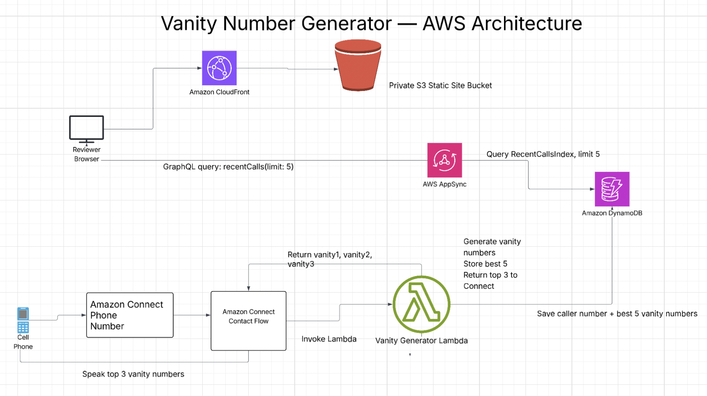

# Vanity Number Generator

A serverless AWS application that generates vanity phone numbers for Amazon Connect callers.

When a caller dials the Amazon Connect phone number, the contact flow invokes a Lambda function. The Lambda function reads the caller's phone number, generates vanity number options, stores the caller number and best five vanity numbers in DynamoDB, and returns the top three options back to Amazon Connect to be spoken to the caller.

The Lambda, DynamoDB table, optional Amazon Connect resources, AppSync GraphQL API, static dashboard, private S3 bucket, and CloudFront distribution are deployable with AWS CDK.

## Architecture




### Voice Flow

1. Caller dials the Amazon Connect phone number.
2. Amazon Connect Contact Flow invokes the Vanity Generator Lambda.
3. Lambda reads the caller's phone number from the Amazon Connect event.
4. Lambda generates and scores vanity number candidates.
5. Lambda stores the caller number and best five vanity numbers in DynamoDB.
6. Lambda returns `vanity1`, `vanity2`, and `vanity3` to Amazon Connect.
7. Amazon Connect speaks the three vanity number options to the caller.

### Dashboard Flow

1. Reviewer opens the dashboard URL.
2. CloudFront serves the static frontend from a private S3 bucket.
3. The frontend calls AppSync with a `recentCalls(limit: 5)` GraphQL query.
4. AppSync queries DynamoDB using the `RecentCallsIndex`.
5. The dashboard displays the last five callers and generated vanity numbers.

The dashboard is the bonus deliverable. It uses the same DynamoDB write model as the voice flow, so the last-five-caller view is populated automatically whenever the Lambda processes a caller.

## How Vanity Numbers Are Ranked

The Lambda normalizes the caller number to digits, uses the last seven digits as the vanity suffix candidate, generates all keypad letter combinations, scores each candidate, stores the best five, and returns the top three to Amazon Connect.

For example, `+18003569377` uses the last seven digits `3569377`, which can map to `FLOWERS`, so the highest-ranked result is `800-FLOWERS`.

"Best" is defined by a simple deterministic scoring model:

- Full dictionary word matches receive the highest score.
- Longer matched words score higher than shorter words.
- Exact seven-character word matches receive an additional bonus.
- Words at the beginning or end of a candidate receive a smaller bonus.
- Candidates containing `0` or `1` are penalized because those digits do not map to letters.
- Rare letters such as `Q`, `Z`, and `X` receive a small penalty.
- Candidates with no dictionary match receive a basic pronounceability score.
- Blocked words receive a large negative score and fall to the bottom.

This approach is intentionally deterministic and easy to explain in a review. In a production system, I would likely expand the dictionary, support customer-specific word lists, add analytics around chosen/played options, and tune scores based on real call outcomes.

## Prerequisites

Before deploying, the reviewer needs:

- Node.js 22 or later.
- AWS CLI configured for the target AWS account and region.
- AWS CDK bootstrap completed in the target account and region.
- AWS permissions to create Lambda, DynamoDB, IAM roles/policies, Amazon Connect, AppSync, S3, CloudFront, and CDK custom resources.
- An AWS region where Amazon Connect is available. The working demo deployment was tested in `us-west-2`.

If the AWS account has not been bootstrapped for CDK yet, run:

```bash
npx cdk bootstrap
```

## Replication Steps

### 1. Install And Verify Locally

Install dependencies, run tests, build TypeScript, and synthesize the CDK template:

```bash
npm install
npm test
npm run build
npm run synth
```

All verification commands should pass before deploying.

## Repository Layout

This repo follows the standard AWS CDK TypeScript project layout, with application code grouped under `src` and deployable infrastructure under `lib`:

- `bin/`: CDK app entrypoint. This is where the stack is instantiated.
- `lib/`: CDK stack definition for Lambda, DynamoDB, Amazon Connect, AppSync, S3, and CloudFront.
- `src/lambdas/vanity-generator/`: Lambda application code for phone normalization, vanity generation, scoring, handler logic, and DynamoDB persistence.
- `frontend/dashboard/`: Static dashboard served through CloudFront.
- `graphql/`: AppSync GraphQL schema.
- `test/unit/`: Unit tests for Lambda behavior and core vanity-number logic.
- `test/infrastructure/`: CDK infrastructure assertions.
- `test/fixtures/`: Sample Amazon Connect event payloads.
- `diagrams/`: Architecture diagram assets.

### 2. Deploy The Backend And Dashboard

For a backend-only deploy without Amazon Connect resources:

```bash
npm run deploy
```

For the most complete demo deployment, let CDK create the Amazon Connect instance too:

```bash
npm run deploy -- --parameters CreateConnectInstance=true
```

This creates:

- Lambda vanity number generator.
- DynamoDB vanity results table.
- AppSync GraphQL API.
- Private S3 bucket for the dashboard.
- CloudFront distribution for the dashboard.
- Amazon Connect instance.
- Amazon Connect Lambda association.
- Amazon Connect contact flow.

CloudFront can take several minutes to finish deploying.

### 3. Understand The Stack Outputs

After deployment, CDK prints outputs similar to:

- `DashboardUrl`: open this in a browser to view the last-five-callers dashboard.
- `DashboardGraphqlUrl`: AppSync GraphQL endpoint used by the dashboard.
- `VanityGeneratorFunctionName`: Lambda function name for direct smoke tests.
- `VanityGeneratorFunctionArn`: Lambda function ARN used by Amazon Connect.
- `VanityResultsTableName`: DynamoDB table where caller results are stored.
- `ManagedConnectInstanceId`: Amazon Connect instance id when CDK created the instance.
- `ManagedConnectInstanceArn`: Amazon Connect instance ARN when CDK created the instance.
- `VanityContactFlowArn`: contact flow ARN when a Connect instance is configured.

Current working demo outputs:

- `DashboardUrl`: `https://d11q46kwproc2d.cloudfront.net`
- `DashboardGraphqlUrl`: `https://yxwnloqcije6jj7k7fkgt63tjy.appsync-api.us-west-2.amazonaws.com/graphql`
- `VanityGeneratorFunctionName`: `VanityNumberGeneratorStac-VanityGeneratorFunctionE-z7cqjkOQG3V8`
- `VanityResultsTableName`: `VanityNumberGeneratorStack-VanityResultsTable61841E4E-1ACZA31DQFQ40`

### 4. Deploy Into An Existing Amazon Connect Instance

If the reviewer already has an Amazon Connect instance, deploy with its instance id:

To also associate the Lambda with an Amazon Connect instance and create the vanity contact flow, pass the instance id:

```bash
npm run deploy -- --parameters ConnectInstanceId=<connect-instance-id>
```

The instance id is the UUID at the end of the Amazon Connect instance ARN. For example, in:

```text
arn:aws:connect:us-east-1:123456789012:instance/98e67a4b-cba4-4e4f-8d87-890c3121ab17
```

the instance id is:

```text
98e67a4b-cba4-4e4f-8d87-890c3121ab17
```

If CDK created the instance, keep passing `CreateConnectInstance=true` on later deploys. CDK will continue using the managed instance from the stack:

```bash
npm run deploy -- --parameters CreateConnectInstance=true
```

### 5. Create An Amazon Connect Admin User

When CDK creates the Amazon Connect instance, it uses `CONNECT_MANAGED` identity management. That means the Connect admin website does not use your AWS Console credentials. You need an Amazon Connect user before you can sign in to the instance access URL, claim a phone number, and inspect the contact flow.

Use the `ManagedConnectInstanceId` stack output as `INSTANCE_ID`:

```bash
INSTANCE_ID=<managed-connect-instance-id>
```

Find the default admin security profile and routing profile:

```bash
SECURITY_PROFILE_ID=$(aws connect list-security-profiles \
  --instance-id "$INSTANCE_ID" \
  --query "SecurityProfileSummaryList[?Name=='Admin'].Id | [0]" \
  --output text)

ROUTING_PROFILE_ID=$(aws connect list-routing-profiles \
  --instance-id "$INSTANCE_ID" \
  --query "RoutingProfileSummaryList[?Name=='Basic Routing Profile'].Id | [0]" \
  --output text)
```

Confirm both ids were found:

```bash
echo "$SECURITY_PROFILE_ID"
echo "$ROUTING_PROFILE_ID"
```

Create an initial Connect admin user:

```bash
aws connect create-user \
  --instance-id "$INSTANCE_ID" \
  --username admin \
  --password 'Choose-A-Strong-Temp-Password1!' \
  --identity-info FirstName=Admin,LastName=User,Email=you@example.com \
  --phone-config PhoneType=SOFT_PHONE,AutoAccept=false,AfterContactWorkTimeLimit=0 \
  --security-profile-ids "$SECURITY_PROFILE_ID" \
  --routing-profile-id "$ROUTING_PROFILE_ID"
```

Then sign in to the Amazon Connect access URL with the `admin` username and the password you supplied.

### 6. Claim A Phone Number

Phone number claiming remains manual because number availability, country requirements, quotas, and account permissions vary by AWS account and region.

In the Amazon Connect admin website:

1. Log in to the Amazon Connect admin website for the instance.
2. Complete any first-run instance setup required by your account.
3. Claim a phone number in the same Connect instance.
4. Copy the phone number id from the phone number ARN.
5. Redeploy with `PhoneNumberId` to point the number at the CDK-managed vanity flow.

To point an already-claimed Connect phone number at the CDK-managed contact flow, pass the phone number id:

```bash
npm run deploy -- --parameters ConnectInstanceId=<connect-instance-id> --parameters PhoneNumberId=<phone-number-id>
```

If CDK created the instance and you claimed a number in it, use:

```bash
npm run deploy -- --parameters CreateConnectInstance=true --parameters PhoneNumberId=<phone-number-id>
```

For the current working deployed demo, the claimed Amazon Connect phone number is:

```text
+1 877-426-7567
```

Its phone number id is:

```text
19978cab-c551-442e-9601-b02bf98d4a98
```

The working Amazon Connect instance is:

```text
vanity-number-demo-v2
e95a2b37-66cc-4201-b967-4eca9eaed2b3
https://vanity-number-demo-v2.my.connect.aws
```

The deploy command used to associate the working number with the CDK-managed contact flow is:

```bash
AWS_PROFILE=vanity-new AWS_REGION=us-west-2 npm run deploy -- \
  --parameters ConnectInstanceId=e95a2b37-66cc-4201-b967-4eca9eaed2b3 \
  --parameters PhoneNumberId=19978cab-c551-442e-9601-b02bf98d4a98
```

### 7. Verify The Full Flow

After the phone number is associated with the contact flow:

1. Call the claimed Amazon Connect phone number.
2. Confirm Amazon Connect speaks three vanity options.
3. Open `DashboardUrl`.
4. Confirm the caller appears in the last-five-callers dashboard.
5. Check the DynamoDB table from `VanityResultsTableName` to verify the stored item contains the caller number and best five vanity results.

## Phone Number Quota Note

Amazon Connect phone number claiming was initially blocked by a resource-level quota. In some AWS accounts, the `Phone numbers per instance` quota for a newly-created instance may show an applied quota value of `0`, even though the AWS default quota is higher. When that happens, Connect returns:

```text
The allowed limit for claimed phone numbers has been exceeded for your instance
```

Check the quota in AWS Console:

1. Open **Service Quotas**.
2. Choose **AWS services**.
3. Choose **Amazon Connect**.
4. Open **Phone numbers per instance**.
5. Select the resource ARN for the Connect instance.
6. Choose **Request increase at resource level**.
7. Request at least `1` phone number.

After AWS approves the quota increase, return to the Connect admin website, claim a phone number, copy the phone number id from its ARN, and redeploy:

```bash
npm run deploy -- --parameters CreateConnectInstance=true --parameters PhoneNumberId=<phone-number-id>
```

The final working demo uses a `us-west-2` Connect instance where the phone-number and concurrent-call quotas allow inbound calls. If a reviewer sees a fast busy tone or no Connect contact records in a different AWS account, check this quota in addition to `Phone numbers per instance`.

## Smoke Test Without A Live Call

The Lambda can be tested directly without placing a phone call. Use the deployed function name from the stack output:

```bash
aws lambda invoke \
  --function-name <vanity-generator-function-name> \
  --payload fileb://test/fixtures/connect-event.json \
  response.json

cat response.json
```

Expected response shape:

```json
{
  "status": "OK",
  "vanity1": "800-FLOWERS",
  "vanity2": "...",
  "vanity3": "...",
  "callerNumberMasked": "***-***-9377"
}
```

The Lambda also writes the caller number and best five vanity results to DynamoDB.

You can verify the dashboard without placing a live call by running the Lambda smoke test first and then refreshing `DashboardUrl`.

## Troubleshooting

### Dashboard Is Empty

The dashboard reads from DynamoDB through AppSync. It will be empty until the Lambda writes at least one item. Run the smoke test or place an inbound call.

### Which Lambda Should Be Tested?

Use the Lambda output named `VanityGeneratorFunctionName`. Do not use the CDK custom-resource Lambda with a name containing `AWS679f53`; that Lambda is created internally by CDK for deployment support.

### Connect Website Does Not Accept AWS Credentials

If CDK created the instance with `CreateConnectInstance=true`, the Connect instance uses `CONNECT_MANAGED` users. Create a Connect admin user with the commands in the replication steps, then sign in with that Connect username and password.

### Phone Number Claiming Fails

```text
The allowed limit for claimed phone numbers has been exceeded for your instance
```

Request a resource-level quota increase for `Phone numbers per instance` in Service Quotas, then claim the number again after approval.

## Testing

Run the local verification suite:

```bash
npm test
npm run build
npm run synth
```

Current coverage includes:

- phone number normalization
- vanity candidate generation
- scoring behavior
- handler success/error behavior
- DynamoDB write shape
- CDK infrastructure assertions for Lambda, DynamoDB, Connect integration, contact flow, optional Connect instance creation, optional phone-number association, AppSync, S3, and CloudFront

## Implementation Notes

I chose CDK because the project needs repeatable infrastructure and the app is AWS-native. The stack can deploy only the backend, deploy into an existing Connect instance, or create a new Connect instance when `CreateConnectInstance=true`.

The Lambda uses Node.js 22, 256 MB of memory, and a 10-second timeout. The handler is CPU-light and dependency-light, so this is intentionally conservative for a small assignment. In production, I would validate the memory setting with AWS Lambda Power Tuning and use CloudWatch percentile metrics to right-size memory and timeout from real traffic.

The Lambda uses a small dependency-injected persistence boundary so unit tests can verify DynamoDB writes without calling AWS. The production handler creates the DynamoDB writer from `VANITY_RESULTS_TABLE_NAME`.

The handler validates the required Amazon Connect event fields before doing work. If the event is missing `ContactId` or the caller phone number, or if the normalized phone number is invalid, it returns an `ERROR` response instead of writing partial data to DynamoDB.

The DynamoDB table uses `contactId` as the primary key and adds `RecentCallsIndex` with `recentCallsPartition` and `createdAt`. That supports the bonus "last five callers" dashboard without changing the write model later.

The contact flow is generated in CDK so reviewers do not have to manually recreate the flow. Phone number claiming remains manual because AWS account quotas, country requirements, number availability, and phone-number ids are account-specific.

The dashboard is a static frontend deployed to a private S3 bucket and served through CloudFront. It reads a generated `config.js` file containing the AppSync endpoint and API key, then runs the `recentCalls(limit: 5)` GraphQL query. For a production app, I would replace the API key with Cognito or IAM authorization and add user-level access controls.

I used AppSync because this dashboard only needs a small typed read API over DynamoDB. AppSync lets the static frontend query DynamoDB through a GraphQL contract without adding another Lambda/API Gateway read service. API Gateway plus Lambda would also be valid, and I would choose that instead if the dashboard needed complex server-side business logic, request orchestration, or a REST contract.

## Operational Characteristics

This implementation is designed to be resilient and cost-effective at assignment scale:

- Lambda and DynamoDB use managed AWS scaling, so there are no servers to patch or size manually.
- DynamoDB uses on-demand billing, which is cost-effective for unpredictable demo traffic.
- S3 and CloudFront serve the dashboard cheaply and keep static traffic away from Lambda.
- AppSync provides a managed read API for the dashboard and avoids a dedicated read Lambda.
- The Connect flow has a fallback message path if Lambda invocation fails.

Expected runtime profile:

- The handler performs deterministic in-memory scoring and one DynamoDB write.
- Warm invocations should normally complete well under the 10-second timeout.
- Cold starts should be small because the Lambda bundle is small and uses the Node.js runtime without a large framework.
- Actual min, max, average, p95, cold-start, and warm-start timings should be captured from CloudWatch Logs/Insights after live traffic is available.

## Shortcuts And Tradeoffs

- The word dictionary is intentionally small and local to the repo.
- The contact flow is minimal: invoke Lambda, speak three values, handle errors, disconnect.
- The DynamoDB removal policy is `DESTROY` for easier cleanup in a demo account. For production, use `RETAIN`.
- Lambda errors are returned to Connect as `ERROR` responses. Production systems should add structured logging, alarms, and richer fallback prompts.
- New CDK-created Connect instances still require manual admin/user setup and phone number claiming.
- The dashboard uses an AppSync API key for a small demo deployment. Production should use authenticated users and tighter API authorization.

## Production Considerations

Before making this production-ready, I would add:

- CloudWatch alarms for Lambda errors, duration, throttles, and DynamoDB write failures.
- Structured JSON logging with contact id correlation.
- Dead-letter queue or failure capture for persistence errors.
- Least-privilege IAM tightened further around Connect custom-resource actions where possible.
- Retained DynamoDB table, backups, and environment-specific removal policies.
- Larger curated dictionaries and business-specific word weighting.
- Input validation around country codes and supported number lengths.
- Load testing for Lambda concurrency and DynamoDB write capacity.
- Cognito or IAM-backed dashboard authentication.
- CI checks for tests, build, synth, and linting.
- Deployment stages for dev/test/prod.

## Current Status

Implemented:

- Lambda vanity number generation.
- Scoring and top-five selection.
- DynamoDB persistence.
- CDK deployment for Lambda, DynamoDB, IAM, optional Connect instance, Lambda association, contact flow, and optional phone-number association.
- Unit and infrastructure tests.
- Architecture diagram.
- Bonus dashboard with AppSync GraphQL API, private S3 hosting, and CloudFront.
- Claimed Amazon Connect phone number `+1 877-426-7567`.
- Phone number association with `vanity-numbers-flow`.
- Live inbound call test completed in the working `us-west-2` deployment.

## Tech Stack

- AWS CDK v2
- TypeScript
- AWS Lambda
- Amazon Connect
- Amazon DynamoDB
- AWS AppSync
- Amazon S3
- Amazon CloudFront
- Jest
